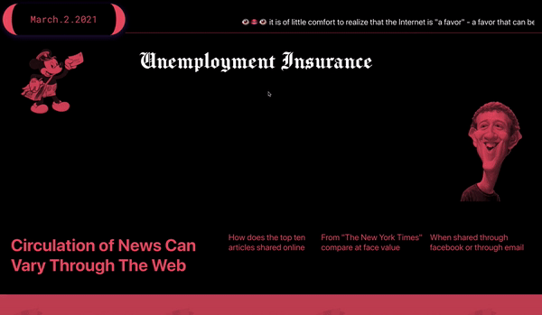

<h1> Extracting the Most Shared Articles on different Social Platforms to see how they compare at face value. </h1>
<h3>Data is extracted using The New York Times REST API </h3>
<H4>Currently Supporting</h4>
<ul>
    <li>Facebook</li>
    <li>Email</li>
    </ul>
    <h4> Working to add </h4> 
    <li> Twitter </li>
    <li> Reddit </li>
      </ul>
    
<h1> Goals </H1>
Build a single page application (SPA) using the React and p5js libraries. A poetic approach to web-design by visualizing data in a creative coding enviroment using p5 library. As well to combine the React declarative programming approach and imperative one for direct DOM manipulation. Avoid any collisions, performance issues, and memory leaks. Use the best of the both approaches.

    Multiple p5 sketches on a same screen;
    Mount sketches in different points of the DOM tree;
    Bidirectional communication between the main React app and sketches;
    Using the latest React features.

This project demonstrates how to combine React (including the latest features such as hooks and context) and p5.js:

    Multiple p5 sketches on a same screen;
    Multiple instances of one sketch mounted in a same component;
    Mount sketches in different points of the DOM tree;
    p5.js libraries support
    Bidirectional communication between the main React app and sketches;
    Using the latest React features:
    Styled-Components
    
The p5.js sketch is wrapped in a React component. The data that comes into the sketch is passed on to this component as props. Callbacks are used to return information back from the sketch to the application.

In the project directory, you can run:

### `npm run build`

Builds the app for production to the `build` folder.\
It correctly bundles React in production mode and optimizes the build for the best performance.

The build is minified and the filenames include the hashes.\
Your app is ready to be deployed!

See the section about [deployment](https://facebook.github.io/create-react-app/docs/deployment) for more information.
